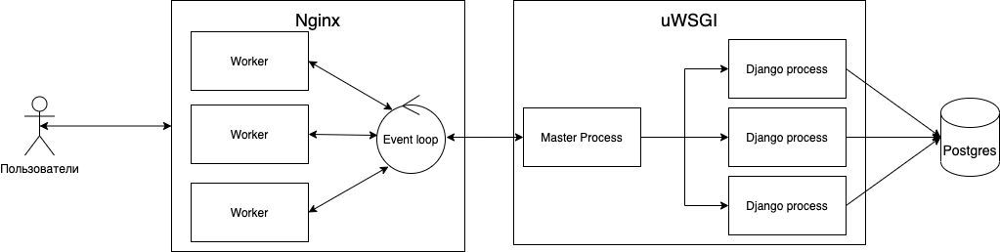

## Проект «Панель администратора + ETL» для кинотеатра

Админка создана на **Django** и позволяет легко и удобно создавать и редактировать сущности и связи в базе данных кинотеатра.  
В рамках проекта также реализован небольшой API, возвращающий список фильмов в формате, описанном в [openapi-файле 💾](/files/django_openapi.yml), и позволяющий получить информацию об одном и обо всех фильмах с пагинацией.  
Также в рамках проекта реализован сервис **ETL** для отказоустойчивого переноса данных из Postgres в Elasticsearch со следующими характеристиками:  
- Сервис ведет себе корректно при потере связи с ES или Postgres. Чтобы сервис  при переподключении не мешал восстановлению БД используется техника backoff.
- При перезапуске приложения оно продолжает работать с места остановки, а не начинает процесс заново (сохраняет свое состояние).
- Перенос данных осуществляется заданными порциями, чтобы не перегружать базы и сеть.

## Используемые технологии

- Приложение создано на **Django**
- В качестве базы данных используется **PostgreSQL**
- Приложение запускается под управлением сервера WSGI **Gunicorn**.
- В для полнотекстового поиска используется **Elasticsearch**
- Для отдачи статических файлов используется **Nginx.**
- Виртуализация осуществляется в **Docker**, взаимодействие между контейнерами через **Docker Compose.**

## Основные компоненты системы

1. **Cервер WSGI/ASGI** — сервер с запущенным приложением.
2. **Nginx** — прокси-сервер, который является точкой входа для web-приложения.
3. **PostgreSQL** — реляционное хранилище данных.
4. **Elasticsearch** - движок и база для полнотекстового поиска.
5. **ETL** - сервис для отказоустойчивого переноса данных и их изменений из PostgreSQL в Elasticsearch

## Схема сервиса

## Запуск приложения

Запуск всех компонентов приложения осуществляется через **Docker Compose.** 
Перед запуском необходимо определить нужные переменные среды в файлах `.env.prod` (для приложения админки) и `.env.db.prod` (для базы данных).
В качестве примера в репозитории лежат соответственно файлы `.env.prod.sample` и `.env.db.prod.sample`.  
Настройки сервиса ETL хранятся в json-файле `postgres_to_es/config.json`. Для ETL можно настроить настроить параметры подключения к базам (`dsn`) Postgres и Elastic, а также параметры переподключения к каждой из баз (`min_backoff_delay` и `max_backoff_delay` - минимальное и максимальное ожидание перед следующей попыткой подключения), интервал проверки новых изменений в базе Postgres `sync_interval`, а также размер "пачки" при переносе данных `batch_size` и др.    
Таким образом, запуск приложения выглядит так:

    $ cp .env.prod.sample .env.prod 
    $ cp .env.db.prod.sample .env.db.prod 
    {опционально: настроить переменные окружения в файлах и параметры сервиса ETL в config.json} 
    $ docker-compose up -d --build 
    
 ## Немного мыслей про ETL
 
### UPD  
Внес правки по ревью, обновил алгоритм ETL - избавился от отдельной таблицы, изменил алгоритм проверки базы Postgres на изменения, удалил часть сигналов (оставил только для таблиц m2m).  

  
#### Предыдущий вариант
В БД создана отдельная таблица для отслеживания апдейтов кинопроизведений, персон, жанров и их связей. Для того, чтобы можно было отследить удаление кинопроизведений, нужно как вариант удалять их из основной таблицы, не удаляя, а например проставляя флажок удаленности, по которому ETL позже бы определял, что запись надо удалить и из его бд. Но в этом случае прилось бы апдейтить логику работы с таблицей кинопроизведений, чего делать бы не хотелось. В том числе поэтому было принято решение завести для отслеживания апдейтов отдельную таблицу.  
С помощью сигналов джанги мы детектим все изменения кинопроизведений, персон, жанров и их связей, определяем фильмы, которые эти изменения затронут и обновляем/добавляем в etl_updates `updated_at` у соответствующего фильма. Далее ETL периодически мониторит эту таблицу и при появлении новых изменений обновляет информацию о соответствующих фильмах в Elasticsearch'e.

